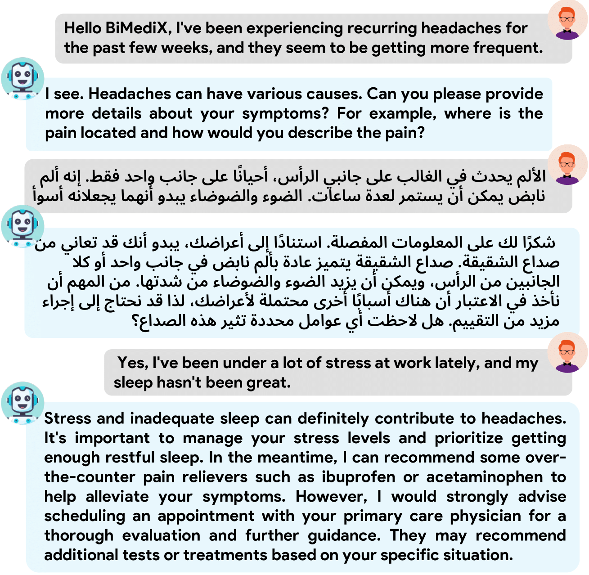
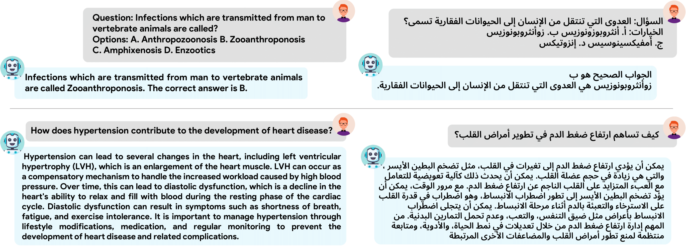

# BiMediX: Bilingual Medical Mixture of Experts LLM

<p align="center">
    
</p>

#### [Sara Pieri](https://scholar.google.com/citations?user=jLNKLsgAAAAJ&hl=en&oi=ao)\*, [Sahal Shaji Mullappilly](https://scholar.google.com/citations?user=LJWxVpUAAAAJ&hl=en)*, [Fahad Khan](https://sites.google.com/view/fahadkhans/home), [Rao Muhammad Anwer](https://scholar.google.com/citations?hl=en&authuser=1&user=_KlvMVoAAAAJ), [Salman Khan](https://salman-h-khan.github.io/), [Timothy  Baldwin](https://scholar.google.com/citations?user=wjBD1dkAAAAJ&hl=en), and [Hisham Cholakkal](https://scholar.google.com/citations?hl=en&user=bZ3YBRcAAAAJ)
\* Equally contributing first authors

#### **Mohamed Bin Zayed University of Artificial Intelligence (MBZUAI), UAE**

[](https://github.com/mbzuai-oryx/BiMediX)
[](https://huggingface.co/BiMediX)
[]()
[](https://796300bc586081681a.gradio.live/)
[](https://github.com/mbzuai-oryx/BiMediX/blob/main/LICENSE.txt)

---

## 📢 Latest Updates
- **Feb-21-24**: BiMediX paper is released [arxiv link](). 🔥🔥
- 📦 Code, models, and datasets coming soon! 🚀
---

## 	:woman_health_worker: Overview
We introduce BiMediX, the first bilingual medical mixture of experts LLM designed for seamless interaction in both English and Arabic.  
Our model facilitates a wide range of **medical interactions** in English and Arabic, including multi-turn chats to inquire about additional details such as patient symptoms and medical history, multiple-choice question answering, and open-ended question answering.

Our models are available for download at the Project's [HuggingFace Page](https://huggingface.co/BiMediX).

---

## 🏆 Contributions

Our contributions are as follows: 

- We introduce BiMediX, the first bilingual medical LLM with expertise in both English and Arabic, enabling seamless medical interactions such as multi-turn chats, multiple choice, and closed question answering.
- We developed a semi-automated translation pipeline with human verification for high-quality translation of English medical texts into Arabic, aiding in the creation of a dataset and benchmark for Arabic healthcare LLM evaluation.
- We curated the BiMed1.3M dataset, a comprehensive Arabic-English bilingual instruction set with over 1.3 million instructions and 632 million healthcare-specialized tokens, supporting diverse medical interactions and enabling a chatbot for patient follow-ups, with a focus on a 1:2 Arabic-to-English ratio across medical content.
- **BiMediX outperforms existing models in medical benchmarks while being 8-times faster than comparable existing approaches.**


---

## 🌟 Model 

---

## 🔍 Data

---

## 💫 Qualitative Results

<div style="text-align:center;">
  
  
</div>

---

## 📊 Quantitative Results

The BiMediX model was evaluated across several benchmarks, demonstrating its effectiveness in medical language understanding and question answering in both English and Arabic.

**Medical Benchmarks Used for Evaluation:**
   - *PubMedQA*: A dataset for question answering from biomedical research papers, requiring reasoning over biomedical contexts.
   - *MedMCQA*: Multiple-choice questions from Indian medical entrance exams, covering a wide range of medical subjects.
   - *MedQA*: Questions from US and other medical board exams, testing specific knowledge and patient case understanding.
   - *Medical MMLU*: A compilation of questions from various medical subjects, requiring broad medical knowledge.


### Bilingual Benchmark

| **Model**                         | **CKG** | **CBio** | **CMed** | **MedGen** | **ProMed** | **Ana** | **MedMCQA** | **MedQA** | **PubmedQA** | **AVG** |
|-----------------------------------|------------|-----------|-----------|-------------|-------------|---------|-------------|-----------|--------------|---------|
| Jais-30B | 57.4       | 55.2      | 46.2      | 55.0        | 46.0        | 48.9    | 40.2        | 31.0      | 75.5         | 50.6    |
| Mixtral-8x7B| 59.1       | 57.6      | 52.6      | 59.5        | 53.3        | 54.4    | 43.2        | 40.6      | 74.7         | 55.0    |
| **BiMediX (Bilingual)**           | **70.6**   | **72.2**  | **59.3**  | **74.0**    | **64.2**    | **59.6**| **55.8**    | **54.0**  | **78.6**     | **65.4**|

BiMediX shows superior performance in bilingual (Arabic-English) evaluations, outperforming both the Mixtral-8x7B base model and Jais-30B. It demonstrated more than 10 and 15 points higher average accuracy, respectively.

### Arabic Benchmark

| **Model**                         | **CKG** | **CBio** | **CMed** | **MedGen** | **ProMed** | **Ana** | **MedMCQA** | **MedQA** | **PubmedQA** | **AVG** |
|-----------|------------|-----------|-----------|-------------|-------------|---------|-------------|-----------|--------------|---------|
| Jais-30B  | 52.1       | 50.7      | 40.5      | 49.0        | 39.3        | 43.0    | 37.0        | 28.8      | 74.6         | 46.1    |
| BiMediX (Arabic) | 60.0 | 54.9 | **55.5** | 58.0 | **58.1** | 49.6 | 46.0 | 40.2 | 76.6 | 55.4 |
| **BiMediX (Bilingual)** | **63.8** | **57.6** | 52.6 | **64.0** | 52.9 | **50.4** | **49.1** | **47.3** | **78.4** | **56.5** |

 In Arabic-specific evaluations, BiMediX outperforms Jais-30B in all categories, highlighting the effectiveness of the BiMed1.3M dataset and bilingual training.
 
### English Benchmark

| **Model**                         | **CKG** | **CBio** | **CMed** | **MedGen** | **ProMed** | **Ana** | **MedMCQA** | **MedQA** | **PubmedQA** | **AVG** |
|-----------------------|------------|-----------|-----------|-------------|-------------|---------|-------------|-----------|--------------|---------|
| PMC-LLaMA-13B         | 63.0       | 59.7      | 52.6      | 70.0        | 64.3        | 61.5    | 50.5        | 47.2      | 75.6         | 60.5    |
| Med42-70B             | 75.9       | 84.0      | 69.9      | 83.0        | 78.7        | 64.4    | 61.9        | 61.3      | 77.2         | 72.9    |
| Clinical Camel-70B    | 69.8       | 79.2      | 67.0      | 69.0        | 71.3        | 62.2    | 47.0        | 53.4      | 74.3         | 65.9    |
| Meditron-70B          | 72.3       | 82.5      | 62.8      | 77.8        | 77.9        | 62.7    | **65.1**    | 60.7      | 80.0         | 71.3    |
| **BiMediX**           | **78.9**   | **86.1**  | **68.2**  | **85.0**    | **80.5**    | **74.1**| 62.7        | **62.8**  | **80.2**     | **75.4** |

BiMediX also excells in English medical benchmarks, surpassing other state-of-the-art models like Med42-70B and Meditron-70B in terms of average performance and efficiency.

**These results underscore BiMediX's advanced capability in handling medical queries and its significant improvement over existing models in both languages, leveraging its unique bilingual dataset and training approach.**

---

## 📜 License & Citation 

BiMediX is released under the CC-BY-NC-SA 4.0 License. For more details, please refer to the [LICENSE](https://github.com/mbzuai-oryx/BiMediX/blob/main/LICENSE.txt) file included in this repository.    

**This release, intended for research, is not ready for clinical or commercial use.** Users are urged to employ BiMediX responsibly, especially when applying its outputs in real-world medical scenarios. 
It is imperative to verify the model's advice with qualified healthcare professionals and not to rely on AI for medical diagnoses or treatment decisions.
Despite the overall advancements BiMediX brings to the field of medical NLP, it shares common challenges with other language models, 
including hallucinations, toxicity, and stereotypes.   
BiMediX's medical diagnoses and recommendations are not infallible.

If you use BiMediX in your research, please cite our work as follows:  

```bibtex

```

## 🙏 Acknowledgements

We are thankful to [Mistral AI](https://huggingface.co/mistralai) for releasing their models and [FastChat](https://github.com/lm-sys/FastChat) and [Axolotl](https://github.com/OpenAccess-AI-Collective/axolotl?tab=readme-ov-file#axolotl) for their open-source code contributions.

---

[](https://github.com/mbzuai-oryx)
[](https://mbzuai.ac.ae)
